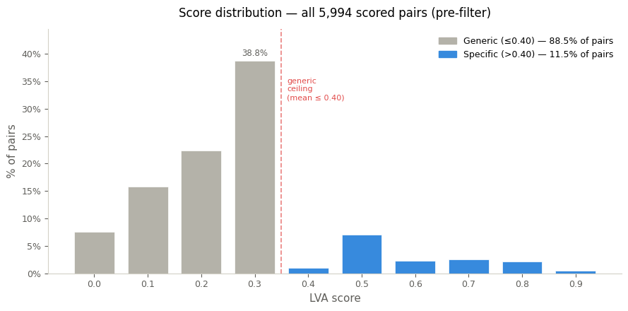
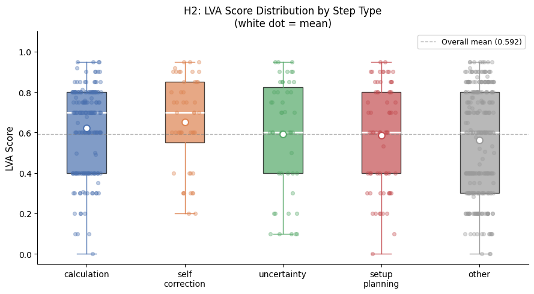
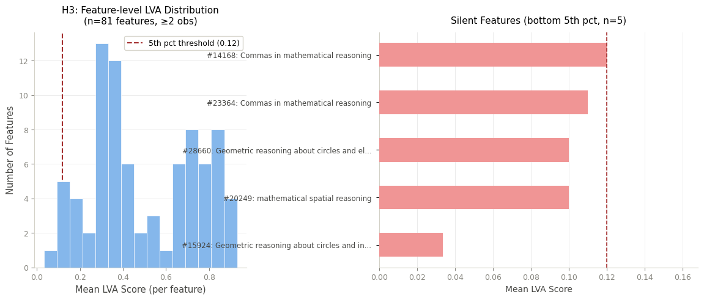

# Latent Verbal Gap

Step-level analysis of how sparse autoencoder (SAE) features align with chain-of-thought (CoT) text in mathematical reasoning traces.

This repository implements the experiments from **“Latent-Verbal Alignment: Characterizing SAE Feature Patterns Across CoT Reasoning Steps”** (Shreeti Shrestha, CS7180 final project).

## Overview

The project introduces **Latent-Verbal Alignment (LVA)**, a correspondence score between:

- a CoT reasoning step (text), and
- the top-k active SAE feature labels at that step.

LVA is used to evaluate whether latent features active during reasoning are actually specific to what the model verbalizes at each step.

## Core Results

From 5,994 scored `(step, feature)` pairs across 93 traces:

- **88.5%** of activated features are generic overlap (`LVA <= 0.40`)
- **11.5%** are step-specific (`LVA > 0.40`)
- Specific features are **step-local** (strong drop under adjacent-step shuffle baseline)
- Specific-feature activation rate differs by step type:
  - setup/planning highest,
  - self-correction lowest
- Conditional quality shows an interesting reversal (self-correction highest mean among specific-only subset), but is treated as suggestive given sample sizes
- Silent-feature analysis highlights auto-interpretation label fidelity failures

## Key Figures

### Overall score mass is mostly generic



### H2: Conditional LVA distribution by step type



### H3: Feature-level silent-feature analysis



## Method Pipeline

1. **Data + activations**
   - Uses Goodfire SAE activations (DeepSeek-R1-671B layer 37)
   - Queries activation rows from DuckDB
2. **Step segmentation**
   - Assistant-only token stream
   - Newline/sentence boundary heuristic
   - Remove special tokens, drop very short fragments
3. **Top-k feature extraction**
   - MAX pooling over token span per step
   - Length normalization to reduce step-length confound
4. **Sampling**
   - Stratified sample by step type and relative position decile
5. **LVA scoring**
   - LLM-as-judge (`claude-haiku-4-5`)
   - Strict rubric on semantic correspondence
6. **Hypothesis tests**
   - **H1**: above-baseline specificity
   - **H2**: variation across reasoning stage types
   - **H3**: persistently low-alignment ("silent") features

## Repository Structure

- `notebooks/step00_setup.ipynb` - environment setup and checkpoints monitoring
- `notebooks/step01_segmentation.ipynb` - step segmentation + top-k feature extraction
- `notebooks/step02_scoring.ipynb` - LVA judge scoring pipeline + baseline prep
- `notebooks/step03_hypothesis_testing.ipynb` - H1/H2/H3 analyses and plots
- `src/config.py` - paths + experiment constants
- `src/utils.py` - DB download/connect + sequence loading
- `src/segmentation.py` - segmentation, step typing, feature extraction
- `src/scoring.py` - judge calls, checkpointed scoring, baselines, reliability checks
- `outputs/` - exported figures

## Setup

```bash
pip install -r requirements.txt
```

Set API key for Anthropic judge calls:

```bash
ANTHROPIC_API_KEY=...
```

You can place this in `.env` (loaded automatically by `src/utils.py`).

## Reproducing the Workflow

Recommended order:

1. Run `notebooks/step00_setup.ipynb`
2. Run `notebooks/step01_segmentation.ipynb`
3. Run `notebooks/step02_scoring.ipynb`
4. Run `notebooks/step03_hypothesis_testing.ipynb`

Notebooks are documented and include cache/checkpoint logic for long-running stages.

## Notes and Limitations

- Current analyses focus on a single layer (layer 37) and math-domain traces.
- LVA depends on auto-interpreted labels; label quality can cap measurable correspondence.
- Some H2/H3 findings are directional and should be replicated at larger scale.

## Citation

If you use this codebase, please cite the associated report:

- Shreeti Shrestha, *Latent-Verbal Alignment: Characterizing SAE Feature Patterns Across CoT Reasoning Steps*, CS7180 Final Report.